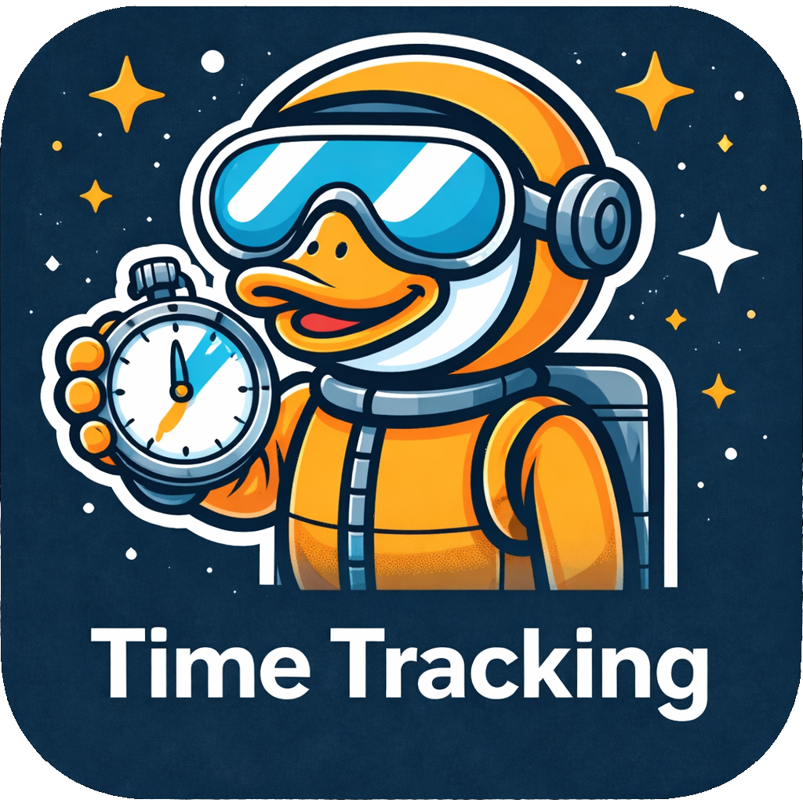

<div align="center">
  <p>
    
  </p>
  <h1>Time Tracking (Frappe App)</h1>
</div>

<div align="center">

[](https://github.com/Rocket-Quack/time_tracking/actions/workflows/ci.yml)
[](https://github.com/Rocket-Quack/time_tracking/actions/workflows/linter.yml)
[](https://github.com/Rocket-Quack/time_tracking/actions/workflows/cypress.yml)
[](https://github.com/Rocket-Quack/time_tracking/pkgs/container/time_tracking)

</div>

Time Tracking is a Frappe app for web-based time tracking and timesheet management.

Teams can record work hours, manage timesheets, generate reports, and export data for invoicing and payroll workflows.


## Supported Versions

| Frappe Version | Time Tracking Version | Branch | Status |
|----------------|-----------------------|--------|--------|
| v16 | v1.x | `version-1` | Supported |

## Installation (Frappe Cloud)

The app can be installed directly via Frappe Cloud:

1. Open the Frappe Cloud dashboard at <https://frappecloud.com/dashboard/#/sites>
2. Click **"New Site"** to create a new site
3. In the step **"Select apps to install"**:
   - Choose the desired Frappe version
   - Enable the app **`Time Tracking`**
4. Complete the wizard to create the site

## Installation (Self-Hosted)

Add the app to your bench environment:

```bash
bench get-app https://github.com/Rocket-Quack/time_tracking.git --branch version-1
```

For development/testing with upcoming v1 changes:

```bash
bench get-app https://github.com/Rocket-Quack/time_tracking.git --branch develop
```

Install requirements:

```bash
bench setup requirements
```

Install the app on a site:

```bash
bench --site time-tracking.yoursite.com install-app time_tracking
```

Run migrations:

```bash
bench --site time-tracking.yoursite.com migrate
```

## Installation (Docker)

Use the prebuilt image to avoid building it yourself. The image is published to GHCR:

```
ghcr.io/rocket-quack/time_tracking:latest
```

`latest` is a moving tag that always points to the most recently published build. Use a version tag (for
example `1.0.0`) to pin a specific image.

```
ghcr.io/rocket-quack/time_tracking:v1.0.0
```

In your `docker-compose.yml` (based on `frappe/frappe_docker`), point the backend services to this image:

```yaml
services:
  backend:
    image: ghcr.io/rocket-quack/time_tracking:v1.0.0
  queue:
    image: ghcr.io/rocket-quack/time_tracking:v1.0.0
  scheduler:
    image: ghcr.io/rocket-quack/time_tracking:v1.0.0
  websocket:
    image: ghcr.io/rocket-quack/time_tracking:v1.0.0
```

Keep the remaining services (database, redis, frontend) as in your standard `frappe_docker` compose.
See the Frappe Docker compose documentation:
[Frappe Docker](https://github.com/frappe/frappe_docker).

## Community Support

Please create a ticket via [Issues](https://github.com/Rocket-Quack/time_tracking/issues) for:

- **Bug Reports & Feature Requests**
- **Questions about general use**

## Trademark Notice

**Frappe** is a trademark of **Frappe Technologies Pvt. Ltd.**

This project is an independent and unofficial app and is not affiliated with Frappe Technologies.
It is not operated, supported, or endorsed by Frappe Technologies.

The name Frappe is used only to describe technical compatibility with the respective framework.

### License

See the LICENSE file for more information.
