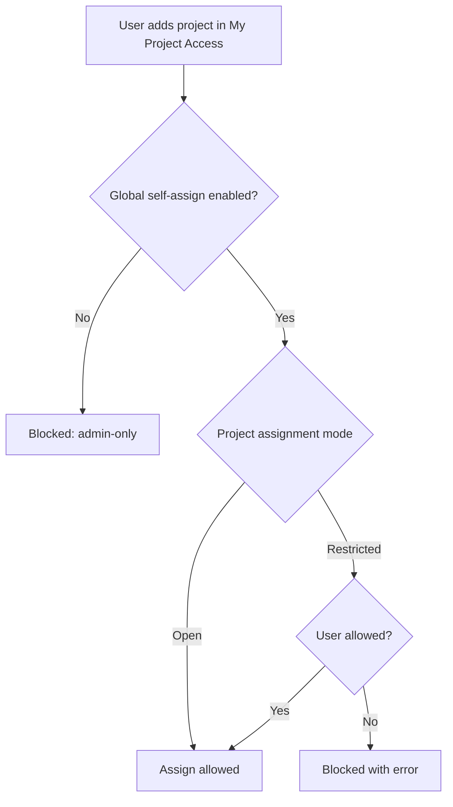

# Access Control

## Roles
The app defines custom roles:
- Time Tracking Employee
- Time Tracking Admin
- Time Tracking Manager

## Profiles
Every user needs a **Time Tracking Profile**. Profiles define:
- Assigned projects (My Project Access)
- Target hours and balances
- Vacation and overtime settings

## Global setting: Require Project Assignment
In **Time Tracking Settings**:
- If enabled: only admins can edit project assignments
- If disabled: users can self-assign projects (subject to project rules)

## Self-assign rules
When self-assign is allowed:
- **Open** projects can be assigned by anyone
- **Restricted** projects can be assigned only if the user is listed in Allowed Users
- Admins can assign any project regardless of Allowed Users

## Workflow: self-assign validation (example)

## Booking permissions
Even after assignment, booking can be blocked if:
- The project is a group node
- The project is Not Bookable
