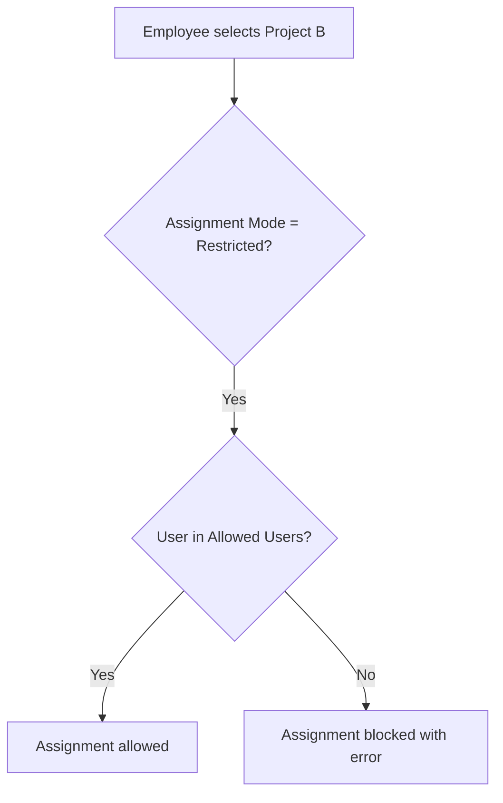

# Overview

This document summarizes the current scope of the Time Tracking app and links to the detailed docs.

## What the app does
- Project-based time tracking with weekly entry
- Project hierarchy management (tree view)
- Project access control via user profiles
- Reports for bookings and summaries
- PDF print format for service reports
- Budget and profitability tracking per project
- Vacation, overtime, and holiday tracking (optional)

## Workflow overview (examples)

### Self-assign + book time (Open project)
```mermaid
flowchart TD
    A[Employee opens My Project Access] --> B[Selects Project A (Open)]
    B --> C[Project assigned to profile]
    C --> D[Weekly Booking: add hours]
    D --> E[Time Booking records created]
```

### Restricted project access


## Where to go next
- [Projects](Projects.md)
- [Time Booking](Time-Booking.md)
- [Access Control](Access-Control.md)
- [Reports & Exports](Reports-Exports.md)
- [Configuration](Configuration.md)
- [Known Gaps](Known-Gaps.md)
