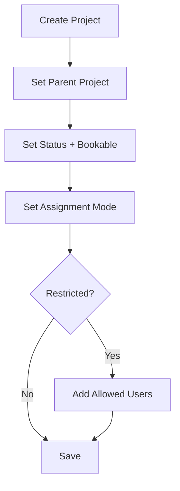

# Projects

## Project model
Projects are stored as **Time Tracking Project** with a tree structure (parent/child). Each project can be a group (non-bookable node) or a leaf (bookable node).

## Key fields
- **Project Name**: Unique name used for hierarchy and links
- **Description**: Optional text
- **Parent Project**: Defines the hierarchy
- **Status**: Active / Inactive (organizational status)
- **Not Bookable**: Booking lock independent from status
- **Assignment Mode**: Open or Restricted
- **Allowed Users**: Only used when Assignment Mode is Restricted

## Status vs Bookable
These are independent:
- **Active + Bookable**: Normal use
- **Active + Not Bookable**: Active for reporting, but no new bookings
- **Inactive + Bookable**: Inactive status, bookings still allowed
- **Inactive + Not Bookable**: Fully inactive and locked

## Workflow: project creation (example)

## Assignment Mode
- **Open**: Any employee can self-assign in My Project Access (if self-assign is allowed globally)
- **Restricted**: Only users listed in Allowed Users can self-assign
- **Admins** can always assign projects in a user profile

## Uniqueness rule
- A project name must be **unique within the same parent** (sibling uniqueness)

## List view
- Status and Bookable show as colored indicators (green/red)
- Filter buttons: Active, Inactive, Bookable, Not Bookable

## Tree view
- Badges show Status and Bookable directly in the tree

## Quick entry
Quick Entry (New button) supports key fields via `in_quick_entry`. If Assignment Mode is Restricted, a banner reminds you to add Allowed Users in the full form.
