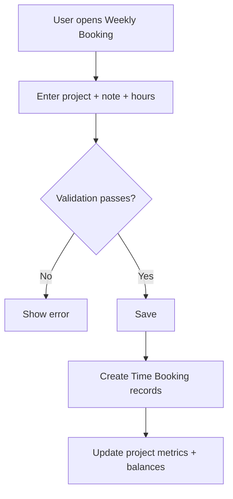

# Time Booking

## Weekly Booking page
The weekly booking UI provides:
- Week navigation (prev/next, Today)
- 7 day columns (Mon-Sun) with daily totals
- Row-based entries (Project, Note, hours per day)
- Week and month totals, forecast, balance
- Suggested rows from last week

## Input format
- Hours can be entered as `H:MM` or decimal and are normalized
- Time is stored internally as minutes

## Booking rules
- Any non-empty weekly booking row must include a project, a note, and time
- Project is required for any row with entered data
- Note is required for any row with entered data
- Time is required for any row with a project or note
- Duration must be a multiple of the configured increment (default 15 minutes)
- Projects that are Not Bookable cannot be booked
- Group projects can only be booked when the corresponding setting is enabled

## Workflow: weekly booking save (example)

## Assigned projects
Weekly booking uses the assigned projects for the current user and shows them as hierarchical path labels
(e.g. `SSS / Customer A / Support`).

## Time Booking doctype
Individual entries are stored in **Time Booking** with date, project, duration, and notes. Validation rules are enforced on save.

## Holidays and vacation
When enabled, holidays are shown in the weekly view and counted in totals. Vacation and sickness projects are handled via settings.
